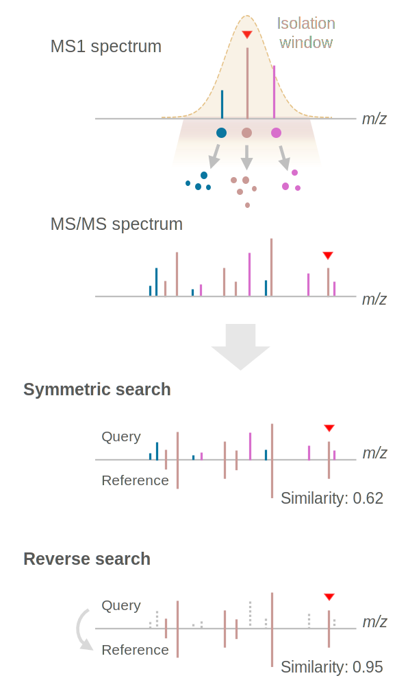

# Reverse MS/MS spectral search

This is the repository for the reverse spectral search project.

## Source codes for symmetric & reverse MS/MS matching
- Cosine similarity: [`cosine.py`](https://github.com/Philipbear/reverse_MSMS_matching/blob/main/reverse_spectral_search/cosine.py)
- Entropy similarity: [`entropy.py`](https://github.com/Philipbear/reverse_MSMS_matching/blob/main/reverse_spectral_search/entropy.py)
- Bhattacharyya angle similarity: [`bhattacharya1.py`](https://github.com/Philipbear/reverse_MSMS_matching/blob/main/reverse_spectral_search/bhattacharya1.py)

## Chimeric spectra analysis
- [`analyze_chimeric_spec.py`](https://github.com/Philipbear/reverse_MSMS_matching/blob/main/chimeric_spectra/analyze_chimeric_spec.py)

## Citation
> Shipei Xing, Yasin El Abiead, Haoqi Nina Zhao, Vincent Charron-Lamoureux, Mingxun Wang, Pieter C. Dorrestein. Reverse spectral search: a simple but overlooked solution for chimeric spectra in metabolite annotation. To be preprinted.

## License
This project is licensed under the Apache 2.0 License (Copyright 2024 Shipei Xing).

