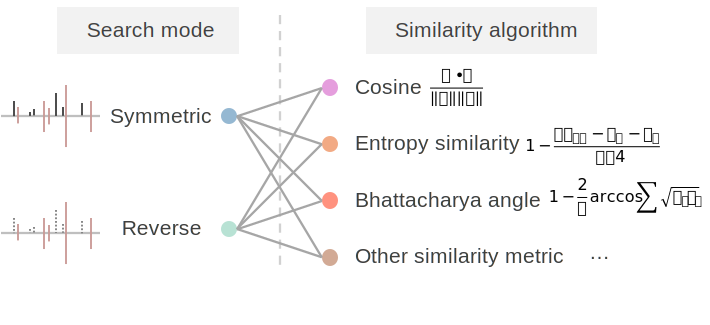

# Reverse spectral search

Chimeric spectra are ubiquitous in MS/MS data, which compromises the quality and reliability of MS/MS matching-based metabolite annotation.
Reverse spectral search is a simple yet overlooked solution to chimeric spectra. 

Here, we enhanced the reverse search by introducing a penalty factor to unmatched peaks, which increases the number of spectral matches while maintaining rigorous quality control.

<table>
<tr>
  <td width="40%" align="center" valign="center">
    
  </td>
  <td width="60%" align="center">
    
    
    
  </td>
</tr>
</table>

## Symmetric & reverse spectral search
- Cosine similarity: [`cosine.py`](https://github.com/Philipbear/reverse_search/blob/main/reverse_spectral_search/cosine.py)
- Entropy similarity: [`entropy.py`](https://github.com/Philipbear/reverse_search/blob/main/reverse_spectral_search/entropy.py)
- Bhattacharyya angle: [`bhattacharya1.py`](https://github.com/Philipbear/reverse_search/blob/main/reverse_spectral_search/bhattacharya1.py)

## Analysis codes
- Chimeric spectra analysis of public datasets: [`analyze_chimeric_spec.py`](https://github.com/Philipbear/reverse_search/blob/main/chimeric_spectra/analyze_chimeric_spec.py)
- Annotation codes: [`annotation` folder](https://github.com/Philipbear/reverse_search/tree/main/annotation)

## Citation
If you use the code from this repository, please cite:
> Shipei Xing. Reverse spectral search. GitHub repository, 2024. URL: https://github.com/Philipbear/reverse_search

[//]: # (> Shipei Xing, Yasin El Abiead, Haoqi Nina Zhao, Vincent Charron-Lamoureux, Mingxun Wang, Pieter C. Dorrestein. Reverse spectral search reimagined: a simple but overlooked solution for chimeric spectra annotation.)

## License
This project is licensed under the Apache 2.0 License (Copyright 2024 Shipei Xing).

